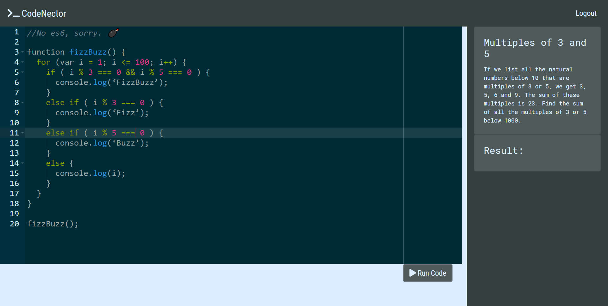

# Codenector

---
CodeNector is a Pair Programming App. It allows multiple users to share the same JavaScript development envirionment. 

---

## Installation

TODO: Describe the installation process

## Contributing

1.Fork it!
2.Create your feature branch: `git checkout -b my-new-feature`
3.Commit your changes: `git commit -am 'Add some feature'`
4.Push to the branch: `git push origin my-new-feature`
5.Submit a pull request :D

## Technologies Used

[React](https://reactjs.org/)

[Redux](https://redux.js.org/)

[Socket.io](https://socket.io/)

[React-Ace](https://github.com/securingsincity/react-ace)

[Passport.js](http://www.passportjs.org/)

[Node.js](https://nodejs.org/en/)

[Express](https://expressjs.com/)

[JawsDB](https://www.jawsdb.com/)

[VM2](https://github.com/patriksimek/vm2)

## Authors

[Ovieh Mosley](https://github.com/ovieh)

[Daniel Perez](https://github.com/perez6736)

## History

TODO: Write history

## Credits

TODO: Write credits

## License

TODO: Write license
